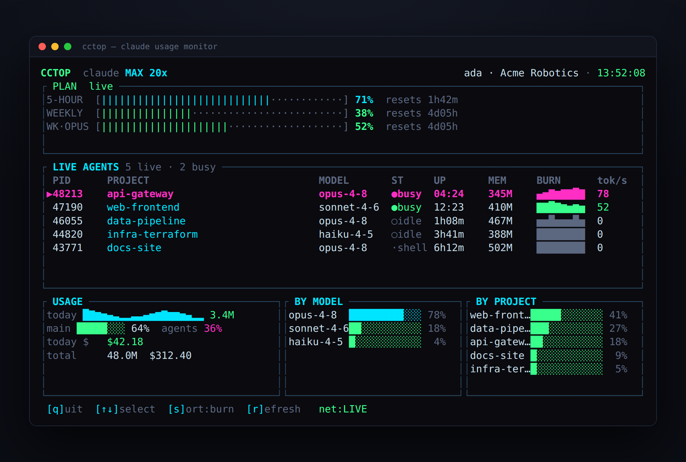

# cctop

A [btop](https://github.com/aristocratos/btop)-style terminal monitor for your Claude usage and running Claude Code agents.



Instead of keeping the **claude.ai usage tab** open in your browser, run `cctop` and watch your plan limits, token spend, and every running Claude Code agent right in your terminal — live.

## Install

**Quick install** — prebuilt binary, no Rust needed.

Linux / macOS (Intel & Apple Silicon):

```sh
curl -fsSL https://raw.githubusercontent.com/y0av/cctop/master/install.sh | sh
```

Windows (PowerShell):

```powershell
irm https://raw.githubusercontent.com/y0av/cctop/master/install.ps1 | iex
```

The rest of the options need a [Rust toolchain](https://rustup.rs) (`cargo`). No system libraries — TLS is bundled (rustls).

**From git:**

```sh
cargo install --git https://github.com/y0av/cctop
```

**From source:**

```sh
git clone https://github.com/y0av/cctop
cd cctop
cargo install --path .
```

**Just build, don't install:**

```sh
git clone https://github.com/y0av/cctop && cd cctop
cargo build --release
./target/release/cctop
```

Either install puts `cctop` on your `PATH` (`~/.cargo/bin`). Then just run:

```sh
cctop
```

## What it shows

- **Plan** — your live 5-hour and weekly limits (the same gauges as *claude.ai/settings/usage*) with reset timers. Falls back to a local estimate when offline.
- **Live agents** — every running Claude Code session as a process row: project, model, busy/idle, uptime, memory, and a live token-burn sparkline.
- **Usage** — today's tokens and cost, main-vs-subagent split, and lifetime breakdowns by model and project.

Token data is read locally from `~/.claude`; the live plan gauges reuse your existing Claude Code OAuth login (Pro/Max). Nothing leaves your machine except the same usage request the CLI already makes.

> **Platform note:** plan gauges and usage history work on Linux, macOS and Windows. The live **process** panel (PID/memory/liveness) currently reads Linux `/proc`, so on macOS/Windows that panel stays empty — everything else works.

## Keys

`q` quit · `↑ ↓` select · `s` cycle sort · `r` refresh

## Flags

| flag | what it does |
|------|--------------|
| `--demo` | run with synthetic data — no account needed |
| `--no-net` | local data only, never touch the network |
| `--once` | print a one-shot text snapshot and exit |

## License

MIT
